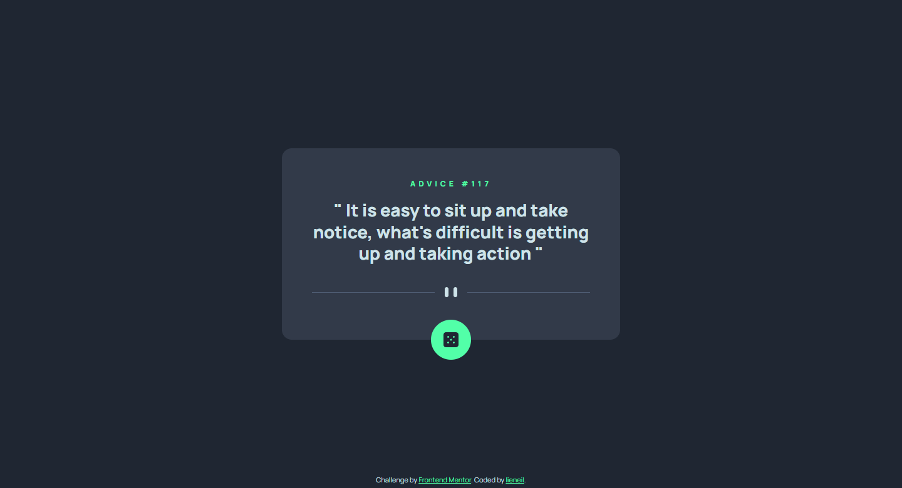
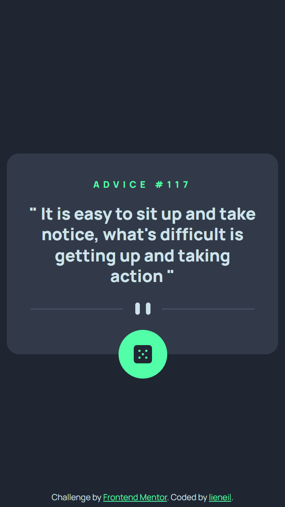

# Frontend Mentor - Advice generator app solution

This is a solution to the [Advice generator app challenge on Frontend Mentor](https://www.frontendmentor.io/challenges/advice-generator-app-QdUG-13db). Frontend Mentor challenges help you improve your coding skills by building realistic projects.

## Table of contents

- [Overview](#overview)
  - [The challenge](#the-challenge)
  - [Screenshot](#screenshot)
  - [Links](#links)
- [My process](#my-process)
  - [Built with](#built-with)
  - [What I learned](#what-i-learned)
  - [Useful resources](#useful-resources)

## Overview

### The challenge

Users should be able to:

- View the optimal layout for the app depending on their device's screen size
- See hover states for all interactive elements on the page
- Generate a new piece of advice by clicking the dice icon

### Screenshot

    

### Links

- [Live Demo](https://njvs.github.io/Advice-generator-app/)

## My process

### Built with

- HTML/CSS
- Vanilla Javascript
- CSS custom properties
- [SASS/SCSS](https://sass-lang.com) - CSS with superpower
- Responsive Web Design

### What I learned

Although this is my first project with data fetching, I'm not new to javascript promises, so this project is not that hard to complete. Also the project design is very simple, there's almost no difference between the desktop and mobile view.

I didn't go overboard with the loading, because I feel like toomuch animation will not suit the simple design of this project (naah, I'm just not that good at thinking up beautiful design LOL). I just set the `max-width` of the `
` to `0` while waiting for the data. I also set a minimum of `1 second` loading time because sometimes the data is fetched so fast.

BTW, I did consider fetch error, so if you wanna see the error message just enter this on the console "`link=''`" and click the button. I declare the `link` variable globally for easy testing.

### Useful resources

- [developer.mozilla.org Fetch](https://developer.mozilla.org/en-US/docs/Web/API/Fetch_API/Using_Fetch)
- [www.javascript.info Fetch](https://javascript.info/fetch)